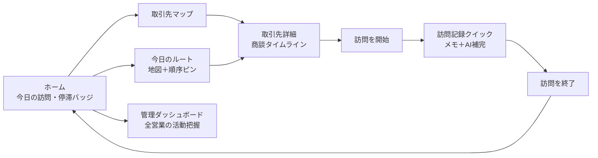

<!--
================================================================
このファイルがソースです。直接編集 → `npm run overview:pdf` で
docs/OVERVIEW.pdf を再生成 → git commit & push でクライアント
共有用 URL も最新化されます。

[ よくある編集箇所 ]
- キャッチコピー: 下の "> **...**" 行
- 機能説明:       "## 主な機能" 配下の各 ###
- スクショ:       UIが変わったら `npm run overview:screenshots`

詳細手順は README.md の「概要書（提案資料）の編集」セクション参照。
================================================================
-->

# 営業管理アプリ — システム概要

> **営業現場の「移動・記録・履歴」をポケット1つに**
> 地図で取引先を可視化し、訪問先で3秒のメモ、取引先ごとに商談タイムラインを時系列閲覧。

---

## 解決する課題

営業活動でよく発生する「3つの抜け漏れ」を1つのアプリで吸収します。

- **訪問後にメモを書けない**: 移動・次の訪問先準備で時間が消え、商談内容の細部が記憶から落ちる
- **どこから回るか考える負担**: 当日の訪問先5件を地図で見て、近い順で組み立てたいが既存ツールだと一覧表とにらめっこ
- **過去の商談が頭から消える**: 半年ぶりの取引先に行く前に「最後に何を話したか」を電話で同僚に確認している

---

## システムの全体像

担当者の操作は **取引先選択 → 訪問記録 → 履歴閲覧** の 3 ステップで完結し、管理者向けには横断ダッシュボードでチームの活動状況を集約します。

**設計上の不変則**

- **メモは1フォーム完結**: メモを書いて「AI で補完」を押すと用件と次のアクションが自動入力、30秒以内で記録が終わる
- **訪問記録は IN_PROGRESS のみ編集可**: 訪問終了後は閲覧専用、誤更新を物理的に防ぐ
- **マスタの編集導線は管理画面に一本化**: 取引先 / 連絡先 / 担当者の更新経路を1つに集約
- **位置情報は訪問時のみ取得**: 移動中の連続トラッキングは行わない

**構成画面の役割**

| 画面 | 役割 | 主な利用者 |
|---|---|---|
| ホーム | 今日の訪問・未記録・停滞バッジを集約 | 営業担当 |
| 取引先マップ | 地図上で取引先を俯瞰、ランク × 停滞日数の2軸ピン色分け | 営業担当 |
| 取引先一覧 / 詳細 | 基本情報・訪問履歴・進行中商談・主要担当者を1画面に | 営業担当 |
| 今日のルート | 当日の訪問予定を地図と時刻順カードで表示 | 営業担当 |
| 訪問記録クイック | メモから AI が用件・次のアクションを補完 | 営業担当 |
| 管理ダッシュボード | 全営業の KPI / 活動表 / 停滞アカウント横断 | 営業マネージャー |

---

## 概要画面

ホームには「今日の訪問」「未記録の訪問」「30日以上停滞している重要取引先」の3バッジが並びます。停滞バッジが赤で点灯していれば、その日のうちに優先して訪問すべき取引先がいるサインです。下部には今日のルートと停滞中の取引先一覧が時刻順・経過日数順で並びます。

---

## 主な機能

### 1. 取引先マップ（ランク × 停滞日数の2軸ピン色分け）

東京エリアの取引先10件を地図上にピン表示。**Aランク × 30日超 → 赤**、Aランク → 濃緑、Bランク × 60日超 → アンバー、Bランク → 緑、Cランク → グレーの2軸合成で、訪問漏れリスクが赤で一目でわかります。ピンをタップすると会社名・最終訪問日・「詳細を見る」リンクがポップアップ表示されます。

### 2. 今日のルート（地図上のルート + 時刻順の訪問予定）

**地図上に出発地（S）→ 訪問先（番号付きピン）→ 帰着地（E）までのルート線を描画**し、当日の動きが一目でわかります。下には時刻順の訪問カードが並び、会社名・予定時刻・状態バッジ（予定 / 訪問中 / 完了）・用件・カテゴリが見えるほか、上部には「完了 / 訪問中 / 予定」の件数サマリーと「予定総距離・移動目安」を表示。各カード右端のナビアイコンをタップすると Google マップで道案内が起動します。

### 3. 訪問記録クイック（メモから AI が用件と次のアクションを補完）

取引先詳細から「✓ 訪問を開始」をワンタップすると、現在地と時刻を自動記録して訪問記録フォームに遷移。商談メモを書いて **「AI で補完」ボタン**を押すと、メモ内容から **用件**（新規提案 / フォロー / クレーム対応 / 関係維持 / 契約 / 納品）と **次のアクション**（内容と日付）を自動推定してフォームに入力します。内容を確認して下部固定の「✓ 訪問を終了する」ボタンで1タップ完了。

### 4. 取引先ごとの商談タイムライン

取引先詳細ページに、過去の訪問履歴・進行中の商談・主要な担当者を一画面で表示。「最後に誰が来て、何を話したか」を着く前に確認できます。最終訪問からの経過日数が30日を超えていると赤強調で表示され、優先度が直感的に伝わります。

### 5. 停滞バッジで訪問漏れを防止

ホーム画面の停滞バッジは「Aランクかつ30日以上未訪問」の取引先を自動集計。重要顧客への接触が空いている状態を毎朝アプリを開いた瞬間に把握できます。

### 6. 管理者向けダッシュボード

営業マネージャー・管理者向けに、全営業の活動状況を1画面で把握できるダッシュボードを提供。本日の訪問予定数、未記録の訪問件数、停滞中の重要取引先、進行中の商談一覧、過去7日間の活動量サマリーを横断表示します。営業ごとの活動表で「誰の訪問数が少ないか」「どの取引先が長く接触されていないか」がすぐにわかります。
