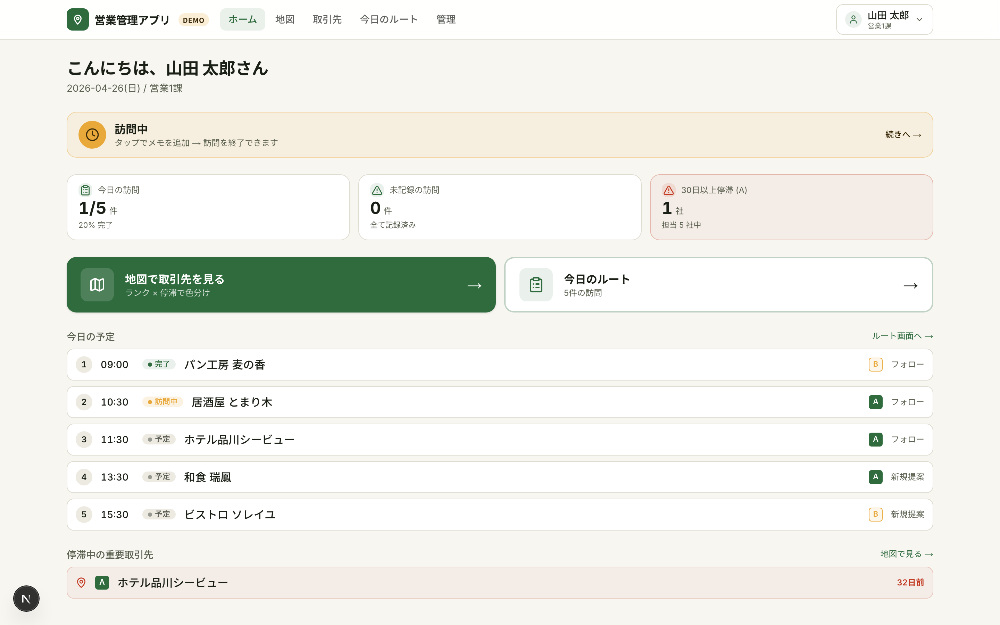
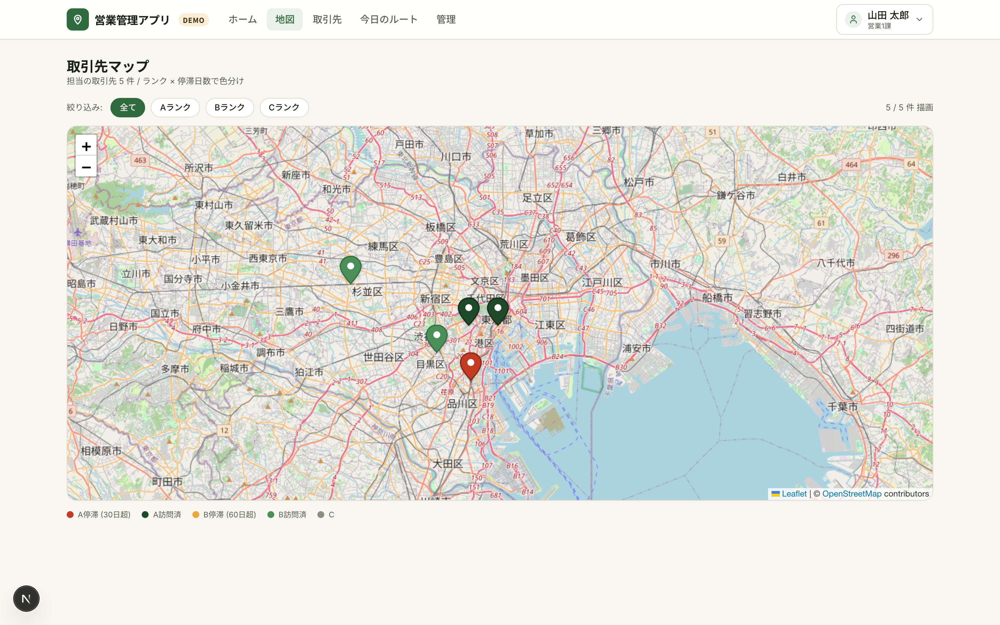
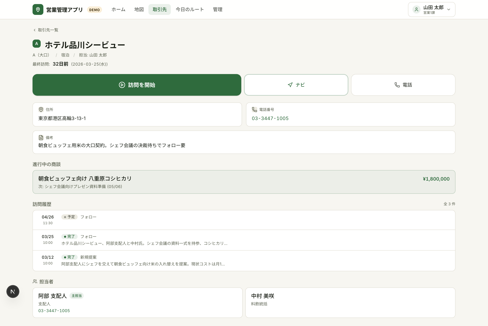
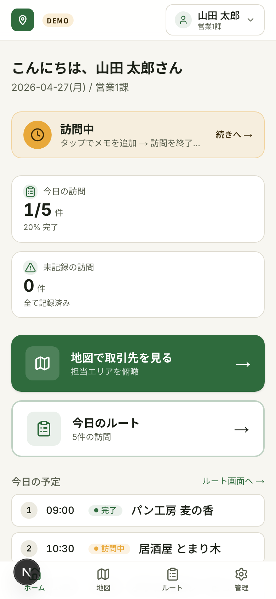
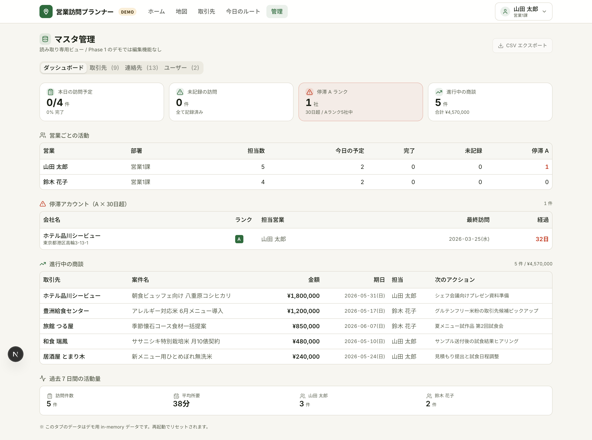

# 営業訪問プランナー — サービス概要

> **営業現場の「移動・記録・履歴」をポケット1つに**
> 地図で取引先を可視化し、訪問先で3秒のメモ、取引先ごとに商談タイムラインを時系列閲覧。

🔗 デモ: **http://localhost:3001**（ローカル動作中。クライアント共有版は Vercel デプロイ後に URL 差し替え予定）

---

## 解決する課題

営業活動でよく発生する「3つの抜け漏れ」を1つのアプリで吸収します。

- **訪問後にメモを書けない**: 移動・次の訪問先準備で時間が消え、商談内容の細部が記憶から落ちる
- **どこから回るか考える負担**: 当日の訪問先5件を地図で見て、近い順で組み立てたいが既存ツールだと一覧表とにらめっこ
- **過去の商談が頭から消える**: 半年ぶりの取引先に行く前に「最後に何を話したか」を電話で同僚に確認している

---

## 概要画面

ホームには「今日の訪問」「未記録の訪問」「60日以上停滞している重要取引先」の3バッジが並びます。停滞バッジが赤で点灯していれば、その日のうちに優先して訪問すべき取引先がいるサインです。下部には今日のルートと停滞中の取引先一覧が時刻順・経過日数順で並びます。

---

## 主な機能

### 1. 取引先マップ（ランク × 停滞日数の2軸ピン色分け）

仙台エリアの取引先10件を地図上にピン表示。**Aランク × 60日超 → 赤**、Aランク → 濃緑、Bランク × 90日超 → アンバー、Bランク → 緑、Cランク → グレーの2軸合成で、訪問漏れリスクが赤で一目でわかります。ピンをタップすると会社名・最終訪問日・「詳細を見る」リンクがポップアップ表示されます。

### 2. 訪問記録クイック（音声・テキスト両対応）

取引先詳細から「✓ 訪問を開始」をワンタップすると、現在地と時刻を自動記録して訪問記録フォームに遷移。フォーム最上部に画面幅いっぱいの大型録音ボタン、その下にテキストメモ欄、用件選択（新規提案/フォロー/クレーム対応/関係維持/契約/納品）、次のアクション欄を配置。画面下部固定の「✓ 訪問を終了する」ボタンで1タップ完了。

### 3. 取引先ごとの商談タイムライン

取引先詳細ページに、過去の訪問履歴・進行中の商談・主要な担当者を一画面で表示。「最後に誰が来て、何を話したか」を着く前に確認できます。最終訪問からの経過日数が60日を超えていると赤強調で表示され、優先度が直感的に伝わります。

### 4. 停滞バッジで訪問漏れを防止

ホーム画面の停滞バッジは「Aランクかつ60日以上未訪問」の取引先を自動集計。重要顧客への接触が空いている状態を毎朝アプリを開いた瞬間に把握できます。

---

## モバイル画面

iPhone / iPad での屋外利用を前提に、深緑（Primary）と稲穂アンバー（Accent）の高コントラスト配色を採用。日光下でも視認性が落ちないよう、白系の薄色は使わず、タップ領域は最小48px・主要CTAは64px以上で設計しています。下部タブバーで「ホーム / 地図 / 訪問 / 管理」を片手で切替できます。

---

## 管理ダッシュボード

取引先・連絡先・営業ユーザーのマスタを一覧表示。タブ切替で対象を変更でき、CSV エクスポート機能でクライアント別のデータ差し替えやバックアップが可能です。

---

## 触り方（クライアント向けデモガイド）

90 秒で価値を体感できる動線:

1. **ホーム画面**を開く → 「停滞 1社」赤バッジが点灯（焼肉 大吉、162日未訪問）
2. **「地図で取引先を見る」**をタップ → 仙台市内10件のピンが表示、赤ピンが1個目立つ
3. 赤ピンをタップ → ポップアップで「詳細を見る」→ **取引先詳細ページ**
4. 「最終訪問: 162日前」が赤強調、「✓ 訪問を開始」ボタンを押す
5. **訪問記録クイック画面**で音声録音 or テキスト入力、用件「フォロー」を選択
6. 下部「✓ 訪問を終了する」ボタンをタップ → ホームに戻り「今日の訪問」件数が更新

ヘッダー右上の **ユーザースイッチャー**で営業担当を切替えると、その担当者の取引先・訪問履歴・停滞バッジに表示が切り替わります。

> **デモモード** で動作中のため、入力データはサーバー再起動でリセットされます。
