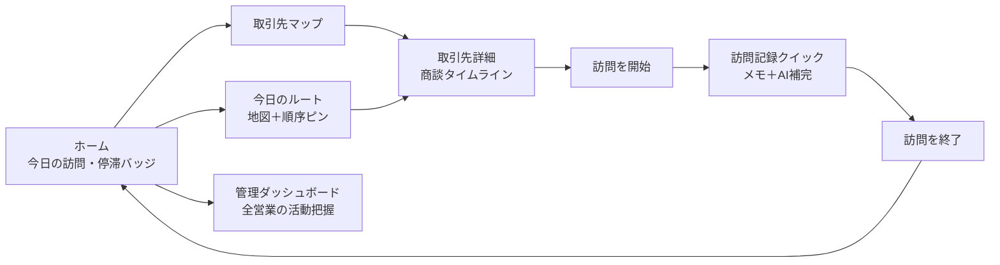
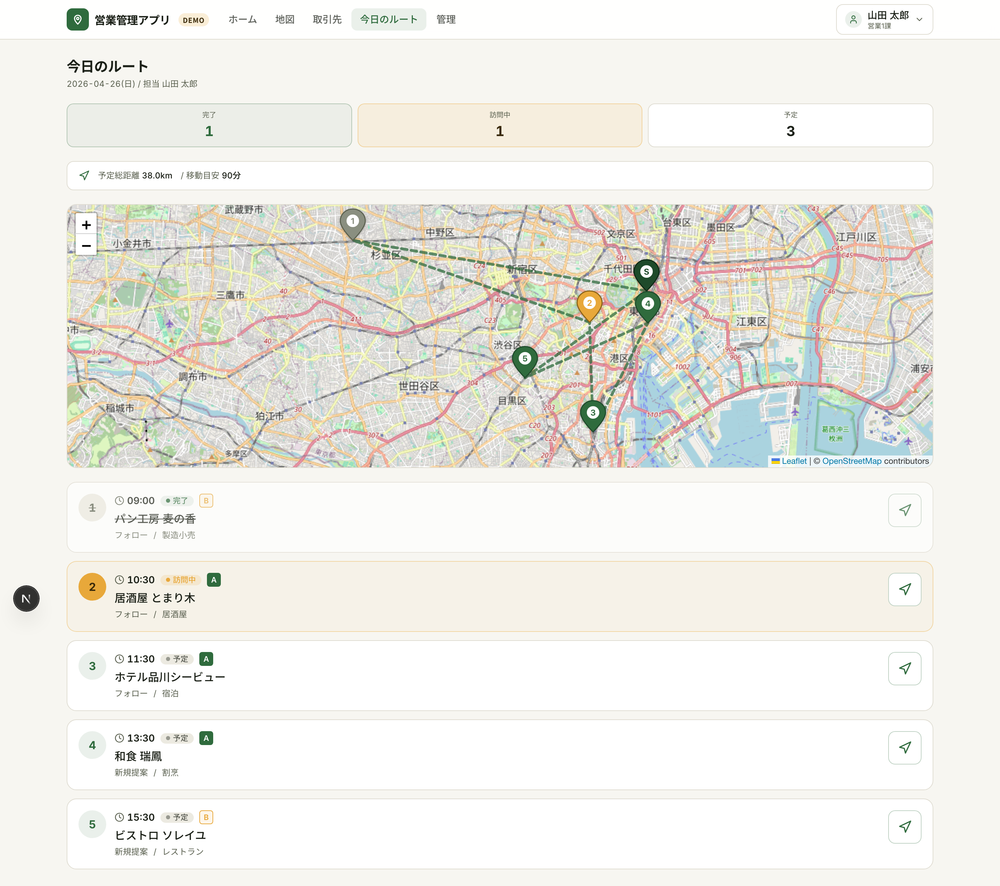
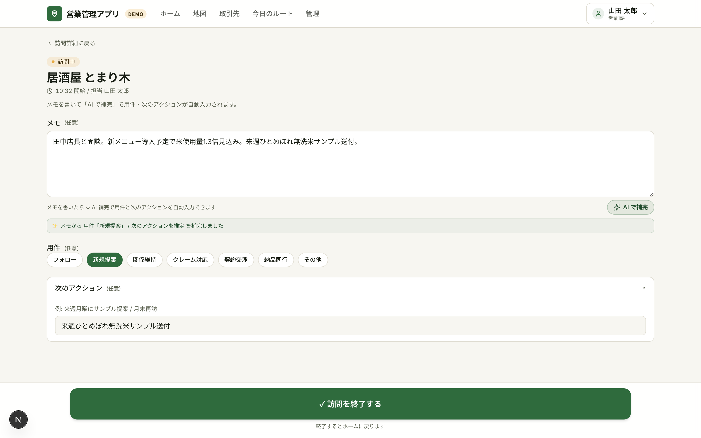

<!--
================================================================
このファイルがソースです。直接編集 → `npm run overview:pdf` で
docs/OVERVIEW.pdf を再生成 → git commit & push でクライアント
共有用 URL も最新化されます。

[ よくある編集箇所 ]
- キャッチコピー: 下の "> **...**" 行
- 機能説明:       "## 営業担当ができること" "## 管理者ができること" 配下の各 ###
- スクショ:       UIが変わったら `npm run overview:screenshots`

詳細手順は README.md の「概要書（提案資料）の編集」セクション参照。
================================================================
-->

# 営業管理アプリ — システム概要

> **営業現場の「移動・記録・履歴」をポケット1つに**
> 地図で取引先を可視化し、訪問先で1分の記録、取引先ごとに商談タイムラインを時系列閲覧。

---

## 解決する課題

営業活動でよく発生する「3つの抜け漏れ」を1つのアプリで吸収します。

- **訪問後にメモを書けない**: 移動・次の訪問先準備で時間が消え、商談内容の細部が記憶から落ちる
- **どこから回るか考える負担**: 当日の訪問先5件を地図で見て、近い順で組み立てたいが既存ツールだと一覧表とにらめっこ
- **過去の商談が頭から消える**: 半年ぶりの取引先に行く前に「最後に何を話したか」を電話で同僚に確認している

---

## システムの全体像

担当者の操作は **取引先選択 → 訪問記録 → 履歴閲覧** の 3 ステップで完結し、管理者向けには横断ダッシュボードでチームの活動状況を集約します。

**設計上の不変則**

- **メモは1フォーム完結**: メモを書いて「AI で補完」を押すと用件と次のアクションが自動入力、1分以内で記録が終わる
- **訪問記録は IN_PROGRESS のみ編集可**: 訪問終了後は閲覧専用、誤更新を物理的に防ぐ
- **マスタの編集導線は管理画面に一本化**: 取引先 / 連絡先 / 担当者の更新経路を1つに集約
- **位置情報は訪問時のみ取得**: 移動中の連続トラッキングは行わない

**構成画面の役割**

| 画面 | 役割 | 主な利用者 |
|---|---|---|
| ホーム | 今日の訪問・未記録・停滞バッジを集約 | 営業担当 |
| 取引先マップ | 地図上で取引先を俯瞰、ランク × 停滞日数の2軸ピン色分け | 営業担当 |
| 取引先一覧 / 詳細 | 基本情報・訪問履歴・進行中商談・主要担当者を1画面に | 営業担当 |
| 今日のルート | 当日の訪問予定を地図と時刻順カードで表示 | 営業担当 |
| 訪問記録クイック | メモから AI が用件・次のアクションを補完 | 営業担当 |
| 管理ダッシュボード | 全営業の KPI / 活動表 / 停滞アカウント横断 | 営業マネージャー |

---

## 概要画面

ホームには「今日の訪問」「未記録の訪問」「30日以上停滞している重要取引先」の3バッジが並びます。停滞バッジが赤で点灯していれば、その日のうちに優先して訪問すべき取引先がいるサインです。下部には今日のルートと停滞中の取引先一覧が時刻順・経過日数順で並びます。

---

## 営業担当ができること

朝の出発から夕方の帰社まで、1日の流れに沿って「やりたいこと」をワンタップで進められます。

### ① 朝、今日の動きを地図で確認する

「今日のルート」を開くと、出発地（東京本社）から訪問先 1〜5、帰着までを **地図上に番号付きピンとルート線で描画**します。完了済みの訪問はグレー、訪問中はオレンジ、これから訪問する先は緑のピンで区別。下には時刻順カードが並び、各カードのナビアイコンをタップすれば Google マップが起動して道案内が始まります。「今日は何時にどこへ行くか」を朝のうちに頭に入れられます。

### ② 取引先を地図で俯瞰、停滞中の重要顧客を一目で見つける

担当している取引先 10 件すべてを地図上にピン表示。**ランク（A/B/C）と最終訪問日からの経過日数で自動的にピン色が変わる** ので、「Aランクなのに 30 日以上行けていない取引先」が赤ピンで一発で目に入ります。ピンをタップすれば会社名・最終訪問日・「詳細を見る」リンクがポップアップで出てきます。

### ③ 訪問前に取引先の過去の商談を時系列で振り返る

取引先詳細を開くと、過去の訪問履歴・進行中の商談・主要な担当者・住所・電話番号を 1 画面に集約。「前回誰が来て、どんな話をしたか」「次のアクションは何だったか」が訪問先に着く前にすぐ確認できます。最終訪問からの経過日数が 30 日を超えると赤強調で表示され、放置状態が直感的に伝わります。

### ④ 訪問記録を1分で終わらせる（メモを書くだけで AI が補完）

取引先詳細の「✓ 訪問を開始」をタップすると、現在地と開始時刻が自動記録されて訪問記録フォームに進みます。あとはメモ欄に商談内容を1〜2文書いて **「AI で補完」ボタン** を押すだけ。メモから「用件」（新規提案 / フォロー / 契約 / 納品など）と「次のアクション」（内容＋日付）が自動で選択・入力されます。内容を確認して下部の「✓ 訪問を終了する」を押せば終了。記録のためにメモを清書したり項目を選んだりする必要がありません。

---

## 管理者ができること

営業マネージャーが「ダッシュボード」タブを開くと、全営業の活動を 1 画面で横断的に把握できます。

ここで確認できる情報:

- **本日の訪問予定**: 全営業の合計件数、うち完了済み（例: 1 / 4 件）
- **未記録の訪問**: 訪問は終わっているのに記録が空の件数。0 件なら全員ちゃんと書けている目印
- **停滞 A ランク**: 30 日以上未訪問の重要取引先が何社あるか、6 社中の何件が停滞しているか
- **進行中の商談**: OPEN な商談すべての件数と合計金額（例: 5 件 / ¥4,570,000）
- **営業ごとの活動表**: 担当数 / 今日の予定 / 完了 / 未記録 / 停滞A を 1 行で。「誰の訪問数が今日少ないか」「停滞Aを抱えているのは誰か」が一目でわかる
- **停滞アカウント横断一覧**: 営業横断で 30 日以上未訪問の重要取引先を最終訪問日が古い順に表示
- **進行中の商談一覧**: 取引先 / 案件名 / 金額 / 期日 / 担当 / 次のアクション。期日超過は赤で強調
- **過去7日間の活動量**: 全社の訪問件数・平均所要時間・営業ごとの内訳

これらが個別の集計画面ではなく、1 つの管理ダッシュボードに集約されているので、朝礼前にチェックする・週次の振り返りで眺める、といった使い方ができます。
